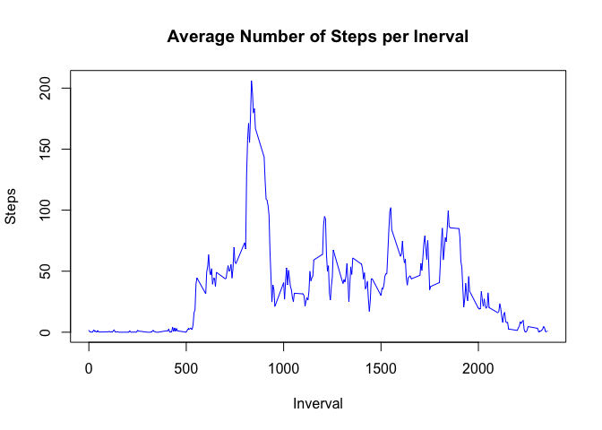
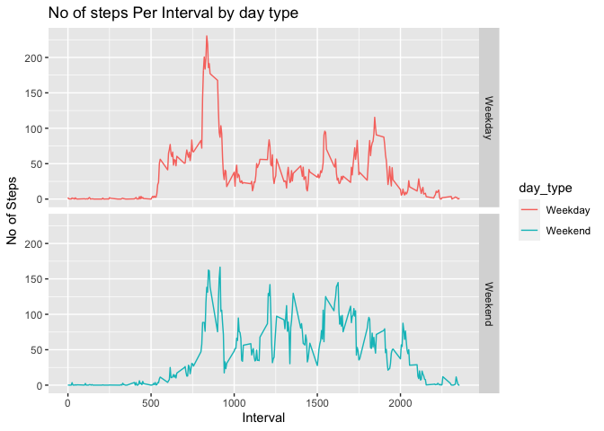

---
output:
  pdf_document: default
  html_document: default
---
# R Markdown Project 1

## Loading and preprocessing the data


```r
#Reading the csv file
activity <- read.csv("activity.csv")
#Preprocessing the data (removing the NA's)
subactivity <- na.omit(activity)
```

## What is mean total number of steps taken per day?

1.Calculate the total number of steps taken per day
2.Make a histogram of the total number of steps taken each day
3.Calculate and report the mean and median of the total number of steps taken per day


```r
#Calculation the total number of steps taken per day
step_perday <- aggregate(steps ~ date, subactivity, sum)
#Histogram of the number of daily steps
hist(step_perday$steps, xlab = "Steps", main = "Histogram of Steps per Day")
```

<!-- -->

```r
#Calculate and report the mean and median of the total number of steps taken per day
mean(step_perday$steps, na.rm = TRUE)
```

```
## [1] 10766.19
```

```r
median(step_perday$steps)
```

```
## [1] 10765
```

# What is the average daily activity pattern?


```r
#The avetage steps per interval
avergeStep_intv <- aggregate(steps ~ interval, subactivity, mean)
plot(avergeStep_intv$interval, avergeStep_intv$steps,
     col = "blue", type = "l", xlab = "Inverval", ylab = "Steps",
     main = "Average Number of Steps per Inerval")
```

<!-- -->

```r
# The interval that contain the maximum of steps
        max_index <- which.max(avergeStep_intv$steps)
        max <- avergeStep_intv[max_index,1]
```
The interval 104 contain the maximum of steps, which is 835.

# Imputing missing values

Note that there are a number of days/intervals where there are missing values NA. The presence of missing days may introduce bias into some calculations or summaries of the data.


1. Calculate and report the total number of missing values in the dataset (i.e. the total number of rows with \color{red}{\verb|NA|}NAs)


```r
sum(is.na(activity))
```

```
## [1] 2304
```

```r
colSums(is.na(activity))
```

```
##    steps     date interval 
##     2304        0        0
```

2. Filling in all of the missing values in the dataset

```r
for(i in 1:nrow(activity)){
        if(is.na(activity$steps[i])){
                res <- avergeStep_intv$steps[which(activity$interval[i] == 
                                        avergeStep_intv$interval)]
                activity$steps[i] <- res
                
        }
        
}
```

4. Make a histogram of the total number of steps taken each day and Calculate and report the mean and median total number of steps taken per day. 


```r
#Lets calculate the new steps per day with the filled data activity
NewStep_perday <- aggregate(steps ~ date, activity, sum)
#Drawing the histogram
hist(NewStep_perday$steps, xlab = "Steps per day",
     main ="Histogram of New Steps per Day")
```

<!-- -->

```r
##Compute the mean and median of the imputed value
mean(NewStep_perday$steps)
```

```
## [1] 10766.19
```

```r
median(NewStep_perday$steps)
```

```
## [1] 10766.19
```

# Are there differences in activity patterns between weekdays and weekends? 


```r
#creating a function that will determine which day is a weekday or weekend 
week_day <- function(date_val) {
    wd <- weekdays(as.Date(date_val, '%Y-%m-%d'))
    if  (!(wd == 'Saturday' || wd == 'Sunday')) {
        x <- 'Weekday'
    } else {
        x <- 'Weekend'
    }
    x
}
```

Now applying the function to the dataset to creat a new varible date


```r
# Apply the week_day function and add a new column to activity dataset
activity$day_type <- as.factor(sapply(activity$date, week_day))
#load the ggplot library
library(ggplot2)
# Create the aggregated data frame by intervals and day_type
steps_per_day_impute <- aggregate(steps ~ interval+day_type, activity, mean)
# Create the plot
g <- ggplot(steps_per_day_impute, aes(interval, steps)) +
    geom_line(stat = "identity", aes(colour = day_type)) +
    theme_gray() +
    facet_grid(day_type ~ ., scales="fixed", space="fixed") +
    labs(x="Interval", y=expression("No of Steps")) +
    ggtitle("No of steps Per Interval by day type")
print(g)
```

<!-- -->
